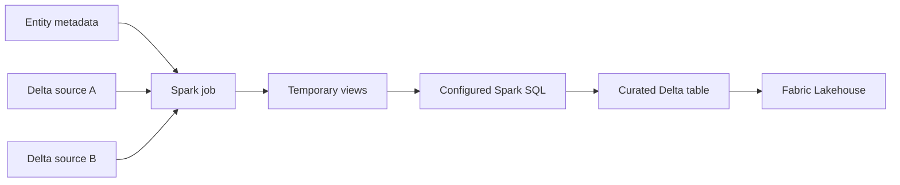

# Metadata-Driven Multi-Source Lakehouse Pattern

A public architecture case study for joining multiple Delta sources in one Spark workload and publishing a curated Delta table to a Microsoft Fabric Lakehouse.

This repository contains original, generic documentation only. It does not contain production code, data, credentials, tenant details, internal resource names, or proprietary schemas.

## Problem

A metadata-driven publisher originally handled one source table per output entity. Some curated entities require data from multiple independently managed Delta tables. Building a separate pipeline for every join increases deployment and operational complexity.

## Pattern

1. Metadata declares an output entity, its source tables, and a transformation query.
2. The Spark workload loads each Delta source.
3. Each source is registered as a temporary SQL view.
4. Spark SQL performs the configured join or transformation.
5. The result is written as one managed Delta table in the target Lakehouse.

## Design Goals

- Add multi-source entities through metadata instead of one-off orchestration.
- Preserve the existing single-source path.
- Separate source discovery, transformation, and target routing.
- Keep environment-specific values outside code and metadata examples.
- Make retries idempotent at the output boundary.

